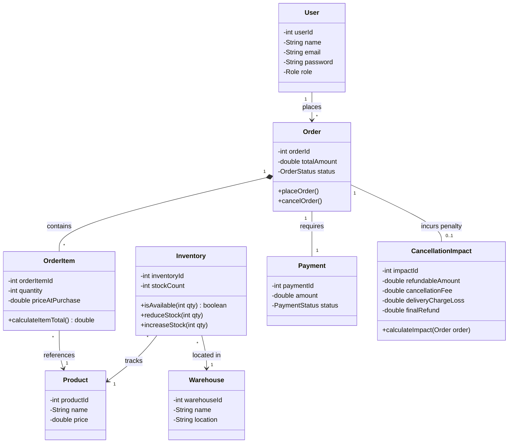
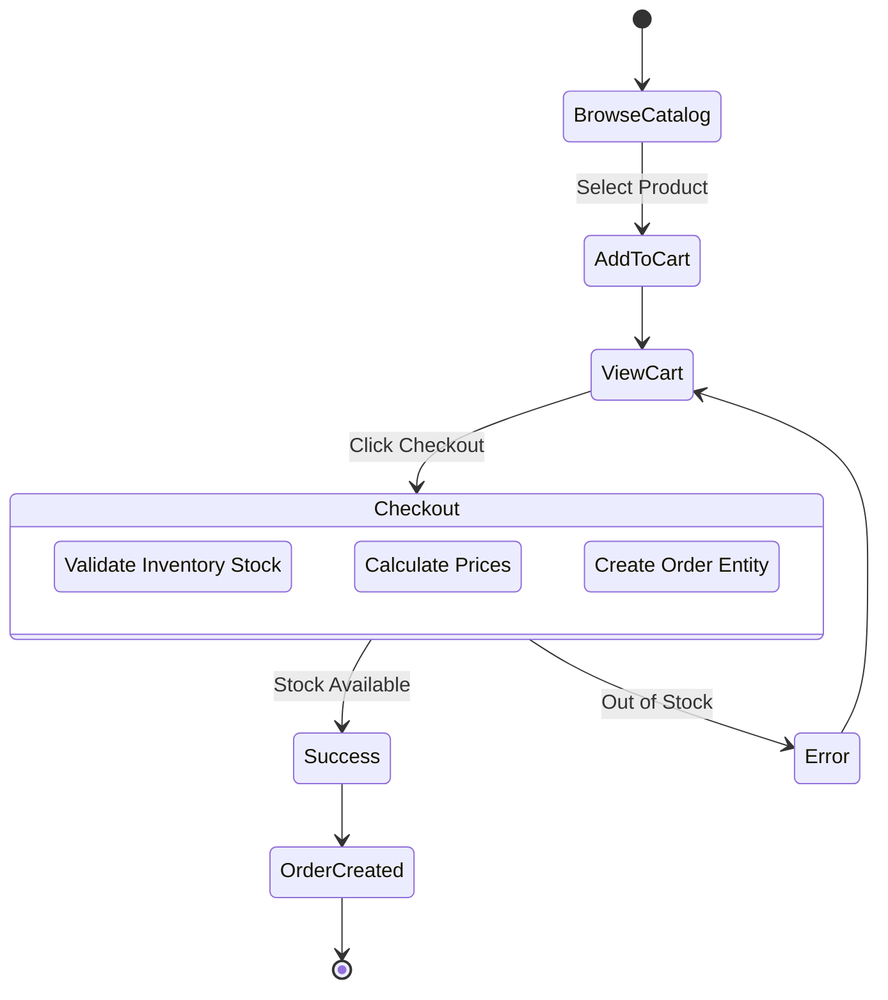
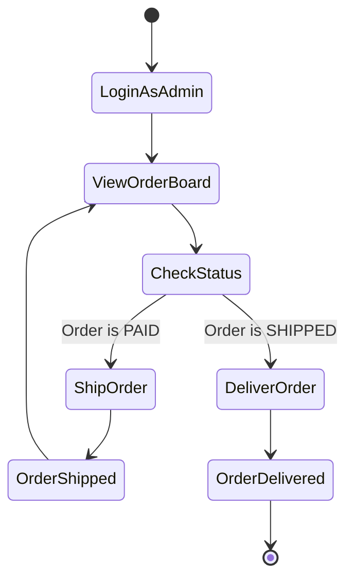
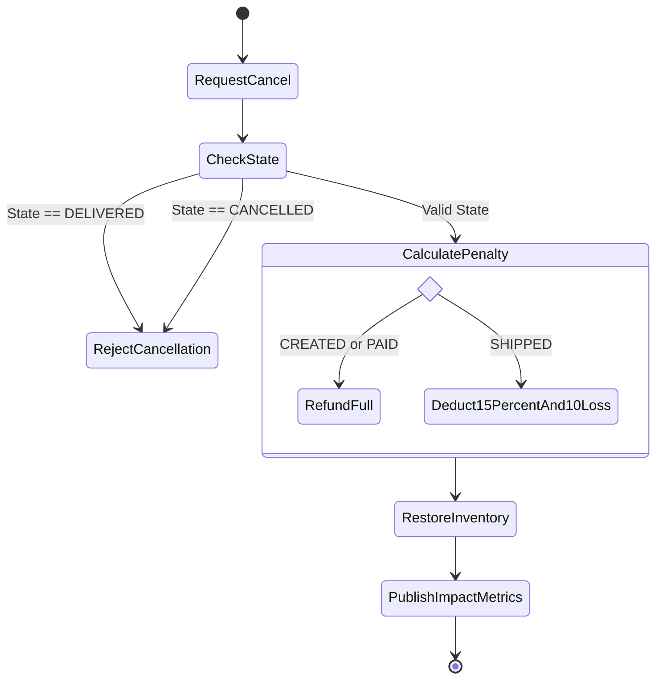
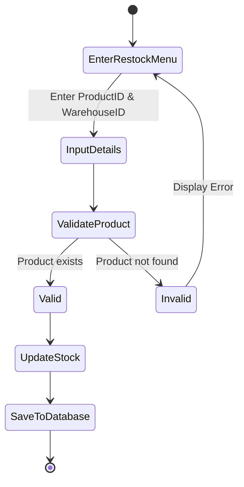
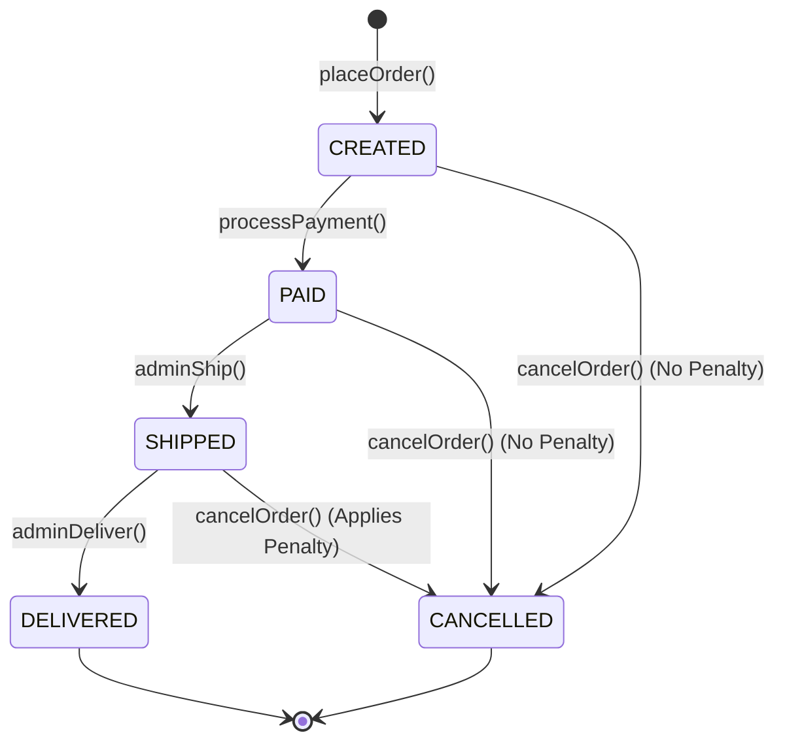
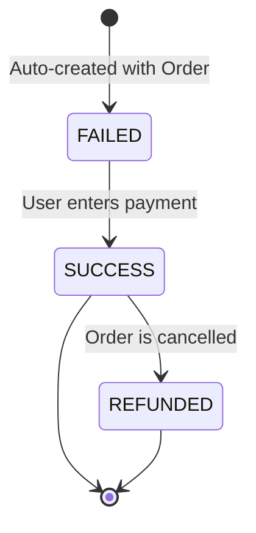
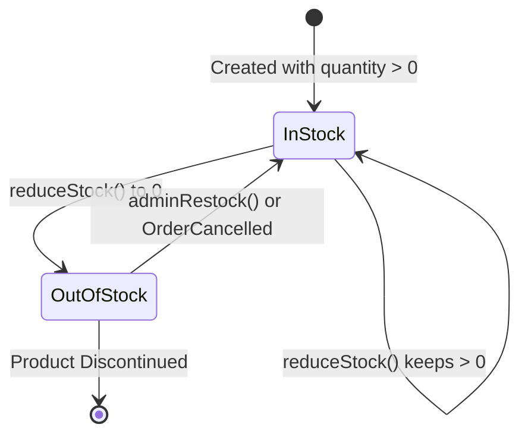
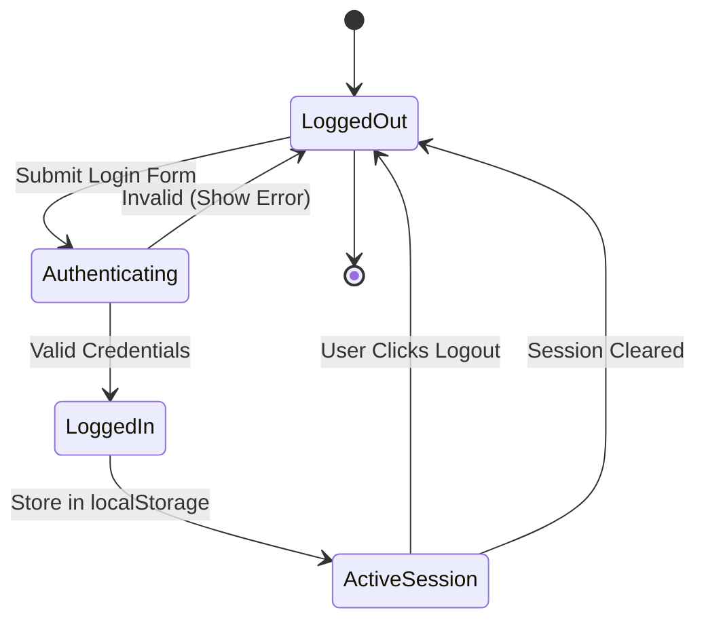

# E-Commerce Nexus - UML Analysis and Design Models

Based on your evaluation criteria image, you need specific quantities of diagrams. I have created all of them below using **Mermaid.js**, a standard text-to-diagram language that renders beautifully in Markdown viewers (like GitHub).

You can copy this exact file directly into your presentation or project documentation, or take screenshots of the rendered diagrams from this Artifact view.

---

## 1. Use Case Diagram (1 Required)

This diagram shows the system boundaries, the actors (Customer and Admin), and the use cases they perform.

```mermaid
usecaseDiagram
    actor Customer as "Customer"
    actor Admin as "Admin"
    
    rectangle "E-Commerce Nexus System" {
        usecase UC1 as "Browse Catalog"
        usecase UC2 as "Manage Shopping Cart"
        usecase UC3 as "Place Order"
        usecase UC4 as "Pay for Order"
        usecase UC5 as "Cancel Order"
        usecase UC6 as "View Order History"
        
        usecase UC7 as "Add New Product"
        usecase UC8 as "Restock Inventory"
        usecase UC9 as "Ship Order"
        usecase UC10 as "Deliver Order"
        usecase UC11 as "View Financial Metrics"
        usecase UC12 as "Login / Register"
    }
    
    Customer --> UC1
    Customer --> UC2
    Customer --> UC3
    Customer --> UC4
    Customer --> UC5
    Customer --> UC6
    Customer --> UC12
    
    Admin --> UC7
    Admin --> UC8
    Admin --> UC9
    Admin --> UC10
    Admin --> UC11
    Admin --> UC12
```

---

## 2. Class Diagram (1 Required)

This diagram outlines the core structural entities of the database model, their attributes, and multiplicity relationships (the ORM mappings).



---

## 3. Activity Diagrams (4 Required)

### Activity Diagram 1: Place Order Flow


### Activity Diagram 2: Order Fulfillment Flow (Admin)


### Activity Diagram 3: Cancel Order & Penalty Calculation Flow


### Activity Diagram 4: Restocking Inventory Flow


---

## 4. State Diagrams (4 Required)

### State Diagram 1: Core Order Lifecycle State Machine
This is the primary Finite State Machine implemented in your Java Service.


### State Diagram 2: Payment Lifecycle State Machine


### State Diagram 3: Inventory Stock State


### State Diagram 4: Authentication Session State

